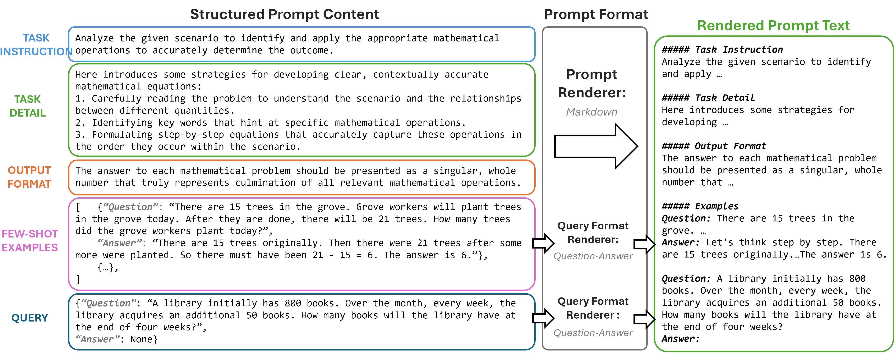
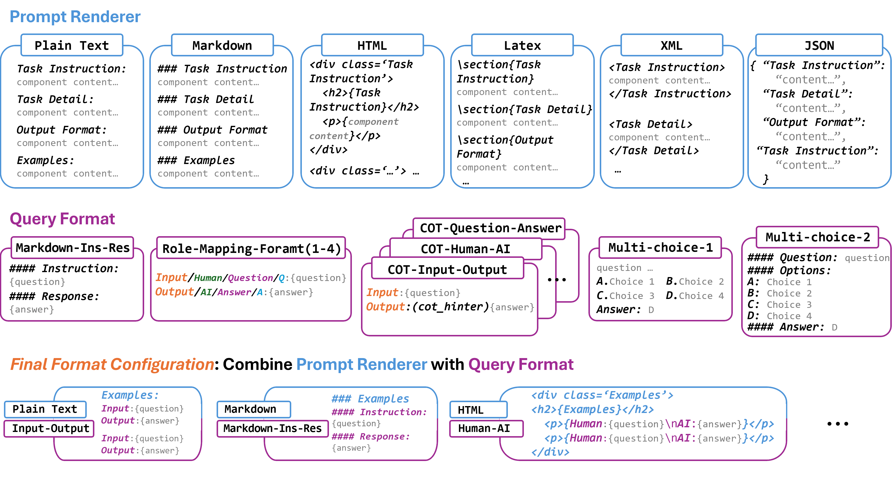

# CFPO - Content Format Prompt Optimization

[](https://arxiv.org/abs/2502.04295)
[](https://huggingface.co/spaces)

Welcome! This repository provides the implementation of:  
**Beyond Prompt Content: Enhancing LLM Performance via Content-Format Integrated Prompt Optimization**

  
_CFPO iteratively optimizes prompt content and format through a two-stage process, combining case-diagnosis, Monte Carlo sampling, and dynamic format exploration._

---

## 🚀 Quick Start

### Option 1: Run on HuggingFace Spaces

1. Clone this repository to HuggingFace Spaces
2. Set `HF_API_TOKEN` in Space secrets
3. The Gradio interface will launch automatically

### Option 2: Run Locally with HuggingFace API

```bash
# Get your free token at https://huggingface.co/settings/tokens
export HF_API_TOKEN=your_token_here

# Run optimization
python main.py --model huggingface --rounds 3

# Or run web interface
python app.py
```

### Option 3: Run Locally with Ollama (Free, Offline)

```bash
# Install Ollama
curl -fsSL https://ollama.com/install.sh | sh

# Pull a model
ollama pull phi

# Run optimization
python main.py --model ollama --model-name phi
```

### Option 4: Use the Setup Script

```bash
# Make executable
chmod +x run.sh

# Run with HuggingFace (default)
./run.sh

# Run with Ollama
./run.sh --ollama

# Run web interface
./run.sh --web
```

---

## Key Contributions

- **Integrated Optimization**: Jointly optimizes **prompt content** (via diagnosis and variations) and **format** (via UCT-based selection and LLM-guided generation).
- **Format optimization strategy**: CFPO employs dynamic format optimization that generates new formats in an iterative manner and evaluates formats through a scoring system.
- **Performance**: CFPO consistently improves LLM performance in a measurable and effective manner.

---

## Methodology

### Intro

  
_Different models exhibit distinct format preferences and no single format consistently outperforms others across all contents._

### Structured Prompt Template

  
In CFPO, prompts are decomposed into:

- **Content Components**: Task instructions, Task Detail, Output Format, Few-shot examples.
- **Format Components**: Prompt renderers (overall structure) and query formats.

### Format Optimization

  
CFPO explores formats through:

1. **Initial Pool**: Predefined formats.
2. **UCT Algorithm**: Balances exploration and exploitation.
3. **LLM-Guided Generation**: Expands the format pool using LLMs.

---

## 📁 Project Structure

```
cfpo_simple/
├── main.py              # CLI entry point
├── app.py               # Web interface (Gradio)
├── optimizer.py         # Core optimization loop
├── run.sh               # Setup and run script
├── requirements.txt     # Python dependencies
├── utils.py             # Helper functions
├── models/
│   ├── base.py          # Base LLM interface
│   ├── ollama.py        # Ollama integration
│   └── huggingface.py   # HuggingFace integration
├── mutators/
│   ├── base.py          # Base mutator interface
│   ├── monte_carlo.py   # Random exploration
│   ├── format_mutator.py # Format changes
│   └── case_diagnosis.py # Learn from errors
├── prompts/
│   └── prompt.py        # Prompt structure
├── tasks/
│   ├── base.py          # Task interface
│   └── gsm8k.py         # Math word problems
└── results/             # Output directory
```

---

## 🔧 Command Line Options

```bash
python main.py [OPTIONS]

Model Options:
  --model {ollama,huggingface}  LLM backend (default: huggingface)
  --model-name NAME             Specific model name
  --hf-mode {providers,api,local}  HuggingFace mode

Optimization Options:
  --rounds N              Optimization rounds (default: 3)
  --beam-size N           Beam width (default: 2)
  --init-temperature F    Mutation temperature (default: 1.0)

Mutator Options:
  --num-feedbacks N       Case diagnosis mutations (default: 1)
  --num-random N          Monte Carlo mutations (default: 2)
  --num-format N          Format mutations (default: 2)

Data Options:
  --task {GSM8K}          Task to optimize (default: GSM8K)
  --train-size N          Training examples (default: 10)
  --valid-size N          Validation examples (default: 5)
```

---

## 📊 Sample Output

```
============================================================
CFPO OPTIMIZATION STARTED
============================================================
Configuration:
   - Rounds: 3
   - Beam Size: 2
   - Mutators: ['MonteCarloMutator', 'FormatMutator']
   - Validation Set: 5 examples
============================================================

ROUND 1/3
   Current beam size: 1 prompts
   Best score so far: 80.00%

MUTATION PHASE:
   [MonteCarlo] Available keywords for mutation:
      ['TASK_INSTRUCTION', 'TASK_DETAIL', 'OUTPUT_FORMAT', 'EXAMPLES', 'COT_HINTER']

   [MonteCarlo] Variation 1:
      - Keywords selected: ['OUTPUT_FORMAT', 'COT_HINTER']
      - Modifying OUTPUT_FORMAT...

EVALUATION PHASE:
   Candidate 1: Score 100.00% | Source: MonteCarloMutator [BEST]
   Candidate 2: Score 80.00% | Source: FormatMutator

ROUND 1 RESULTS:
   1. Score: 100.00% | Action: monte_carlo -> SELECTED FOR BEAM
   2. Score: 80.00% | Action: format_xml
```

---

## 🤖 Supported Models

### HuggingFace Inference Providers

- `meta-llama/Llama-3.1-8B-Instruct` (default)
- `Qwen/Qwen2.5-7B-Instruct`
- `mistralai/Mistral-7B-Instruct-v0.3`
- `deepseek-ai/DeepSeek-R1-Distill-Qwen-32B`

### Ollama (Local)

- `phi` (small, fast)
- `mistral` (balanced)
- `llama2` (larger)

---

## 📄 Citation

```bibtex
@misc{liu2025cfpo,
    title={Beyond Prompt Content: Enhancing LLM Performance via Content-Format Integrated Prompt Optimization},
    author={Yuanye Liu and Jiahang Xu and Li Lyna Zhang and Qi Chen and Xuan Feng and Yang Chen and Zhongxin Guo and Yuqing Yang and Cheng Peng},
    year={2025},
    eprint={2502.04295},
    archivePrefix={arXiv},
    primaryClass={cs.CL},
    url={https://arxiv.org/abs/2502.04295},
}
```

---

## 📝 License

MIT License
