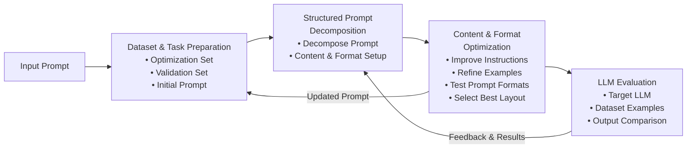

# CFPO Process Diagram

## Mermaid Code

## Description of Changes Made

1. **Removed all colors** - The diagram uses default black/white styling (no fill colors)
2. **Added Input Prompt arrow** - New "Input Prompt" node connects to "Dataset & Task Preparation"
3. **Renamed block** - "Structured Prompt Initialization" → "Structured Prompt Decomposition"
4. **Removed Validation & Testing block** - Replaced with "LLM Evaluation" in its position
5. **Merged optimization blocks** - Combined "Content Optimization" and "Format Optimization" into single "Content & Format Optimization" block

## How to View

1. Copy the mermaid code above
2. Paste into [Mermaid Live Editor](https://mermaid.live/)
3. Export as PNG/SVG

Or open the `cfpo_diagram.html` file in a browser to see the rendered diagram.
